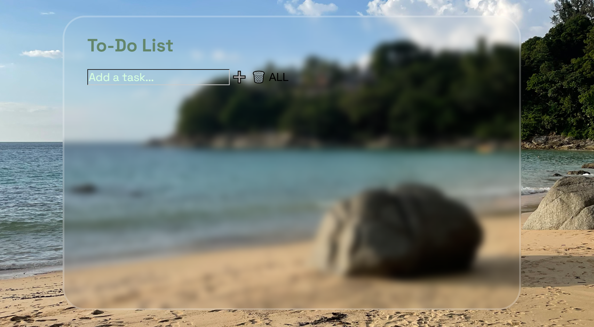

# ✅ To-Do List

A simple browser-based to-do list app built with vanilla JavaScript. 
Add tasks, mark them complete, delete individual tasks, or clear the whole list.

## 🔗 Live Demo
[Try it here](https://rc-simple-todo.netlify.app/)

## ✨ Features
- Add new tasks
- Mark tasks as complete/incomplete
- Delete individual tasks
- Clear the entire list

## 🛠️ Built With
- HTML, CSS, JavaScript

## 🚀 Running Locally
1. Clone the repo
2. Open `index.html` in your browser

## 📚 What I Learned
- Manipulating the DOM to add/remove elements dynamically
- Managing state for a list of items without a framework